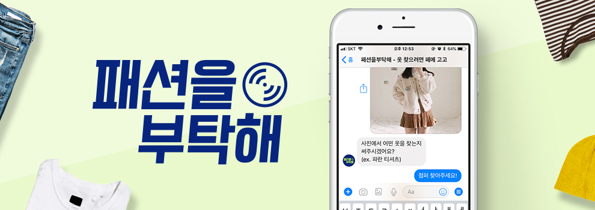

# 패션을부탁해는?

**패션을부탁해**는 사진으로 옷을 찾고싶어하는 사람들을 위해 패션 아이템 검색 챗봇 플랫폼을 제공합니다. 페이스북 챗봇 오픈 6개월 만에 10대 여성 4만 명을 사로잡은 뒤 `스타일쉐어(with 29CM)`와 함께 트렌디한 AI 기술로 패션 업계를 혁신해 나가고 있습니다.

## 🤔 어떻게 성장해 왔나요?

2016년 3월 사업 검증을 위해 8개월간 20,000개의 옷을 직접 찾아주었습니다. 소비자의 니즈를 피부로 느끼며 인사이트를 얻었고 누구보다 옷을 잘 찾을 수 있는 노하우와 메뉴얼을 갖고 있습니다.

2017년 1월 페이스북 챗봇을 오픈하였고 6개월 만에 10대 여성 4만 명을 사로잡으면서 1000% 성장률을 기록했습니다. 챗봇 오픈 후에도 약 10만 개의 옷을 직접 찾아주었고 핵심 데이터를 모았습니다. 이제는 그동안 사람이 했던 역할을 AI 기술로 자동화하기 위해 집중하고 있습니다.

패션을부탁해는 프라이머에게 초기투자를 유치하였고 스타일쉐어에게 4억 원 Seed Round 전략적 투자를 유치하였습니다. 이후 페이스북뿐만 아니라 카카오톡, 네이버톡톡, 라인, 위챗 등 챗봇 플랫폼 영역을 늘려갈 계획이며 현재 패션을부탁해 챗봇을 스타일쉐어 500만 유저가 사용할 수 있도록 스타일쉐어 앱에 연동하고 있습니다. 

## 😎 패부 팀의 조직 문화는 어떤가요?

패션을부탁해 팀의 조직 문화는 5개의 키워드로 정의하고 있습니다.

**`자율, 수평, 성장, 협업, 자부심`**

더 나은 업무 환경과 성과를 위해 출퇴근 시간을 '자율**'적으로 선택합니다. 

소통을 원활하게 하기 위해 '**수평**'한 조직 구조를 지향합니다. 수평의 첫 걸음으로 호칭을 -님으로 통일하고 있습니다.

회사의 성장은 개인의 '**성장**'이 있어야만 가능합니다. 배우고 성장하기 위한 개인의 노력을 최대한 지원하고 있습니다. 

본인의 직무에 '**자부심**'을 갖는 것이 첫 번째 입니다. 그리고 자부심으로 똘똘 뭉친 사람들이 모여 상대방과 다른 점을 인정하고 개선하고 발전하는 '**협업**'문화를 만들어 가고 있습니다.

## 😄 왜 이 일을 하나요?

> 시간과 노력 없이 원하는 옷을 사는 건 어려운 일입니다. 왜 어려울까요?
> 
> 친구가 입고 있는 옷.. 셀럽이 입고있는 옷.. 저 옷을 사고 싶은데 찾으려니 막막하죠.
> 
> 당신은 포기하는 편인가요? 끝까지 찾아내시나요? 어느 쪽이든 상관없습니다.
> 
> 이제 패션을부탁해 팀이 이 문제를 끝내려 합니다.

옷 찾아주는 챗봇을 통해 변화할 대화형 커머스 세상을 상상해 보세요.

개인화된 쇼핑, 최고의 사용 경험!

패션을부탁해 팀은 이 꿈에 가슴이 뜁니다.

## 채용

### 디자인 직군

- [Product designer](careers/product-designer.md) - 채용중

### 개발 직군

- [Software engineer](careers/software-engineer.md) - 채용중
- Deep Learning engineer - 예정 

## 공통 사항

### 혜택 및 복지

- 지옥철을 피해서
  - 자율출퇴근!
- 우리.. 배고프지말아요
  - 삼시 두끼 지원
  - 원하는 간식/음료 마르지 않도록
- 열정 가득한 당신을 위해 
  - 도서구입비 무제한
  - 세미나 및 교육 참여 지원
- 장인은 장비탓을 하지 않지만...
  - 맥북 혹은 iMac + 모니터 등 최신 장비 지원
  - 소프트웨어 구입비 지원
- 행복하자.. 아프지말고
  - 연차 제공
  - 생리 휴가 월 1회 제공
  - 출산전후 휴가 90일 제공
  - 배우자 출산 휴가 5일 제공

### 채용 절차

- 서류전형
- 1차 인터뷰 (실무진)
- 2차 인터뷰 (임원)

### 지원 방법

- 자유형식의 이력서를 help@pleasefashion.co.kr 으로 보내주시면 됩니다.
- 포트폴리오 등 추가로 설명해주실 자료가 있다면 간략한 내용과 함께 보내주세요.
- 메일 제목에 [지원 직군]을 포함시켜주세요.채용 완료 시 본 채용 공고는 마감되며, 진행 과정에 따라 개별 연락 드리겠습니다.

## 참고

- 홈페이지 : [https://about.pleasefashion.co.kr](https://about.pleasefashion.co.kr)
- 챗봇 링크 : [https://m.me/pleasefashion](https://m.me/pleasefashion?ref=campaign%3DGithubApply)
- 페이스북 페이지 : [https://facebook.com/plzfashion](https://facebook.com/plzfashion)
